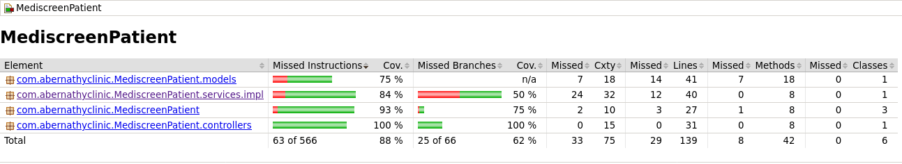
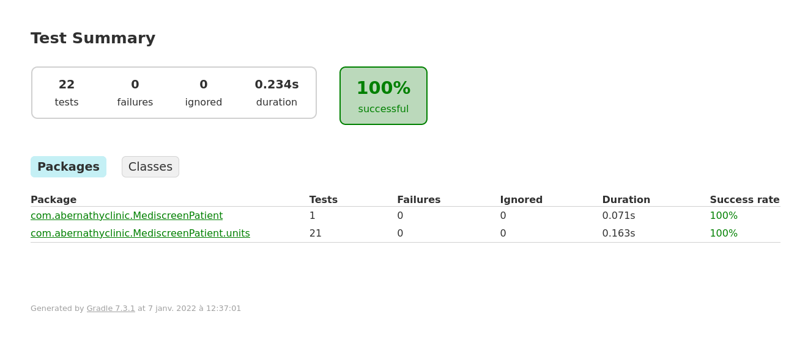

# Projet n°9 : Abernathy Clinic - Patient

Sprint n° 1 : Visualistation, création et mise à jour des patients sur l'application.

Architecture Micro Service Back-End - Spring Boot / Gradle

#### Lien Docker : https://hub.docker.com/r/orionbs/mediscreen_patient

#### Lien Github : https://github.com/OrionBS/Projet9_AbernathyClinic_Patient

#### Lien Github Note History : https://github.com/OrionBS/Projet9_AbernathyClinic_NoteHistory
#### Lien Github Diabete Risk : https://github.com/OrionBS/Projet9_AbernathyClinic_DiabeteRisk
#### Lien Github Front-End : https://github.com/OrionBS/Projet9_AbernathyClinic_FrontEnd

## Pour commencer

### Pré-requis

- IntelliJ (Environnement de développement)
- Java 11
- MySQL
- Gradle 7.3.1

### Téléchargement

```
cd /"dossier de téléchargement"/
git clone https://github.com/OrionBS/Projet9_AbernathyClinic_Patient
cd /Projet9_AbernathyClinic_Patient
```

### Installation

Pensez à intaller les dernières versions de Java, MySQL, Gradle

### Test





Pensez à intaller les dernières versions de Java, MySQL, Gradle

### Paramétrage MySQL

Dans la console, démarrez MySQL
```
mysql
```
Puis créez la base de donnée et l'utilisateur avec ses privilèges.
```
create database mediscreenData;
create user 'userData'@'localhost' identified by 'passwordData';
grant all privileges on mediscreen.* to 'userData'@'localhost';
flush privileges;
```

## Fabriqué avec

* [IntelliJ Community](https://www.jetbrains.com/idea/download/#section=windows) - Environnement de développement
* [Java SE JDK 11](https://www.oracle.com/java/technologies/javase-jdk11-downloads.html) - JDK Java
* [Gradle 3.6.3](https://gradle.org/install/) - Gradle

## Versions

**Dernière version stable :** 1.0

## Auteurs
Listez le(s) auteur(s) du projet ici !
* **Orion Beauny** _alias_ [@OrionBS](https://github.com/OrionBS)
* Tous les [contributeurs](https://github.com/OrionBS/Projet9_AbernathyClinic_Patient/contributors)

## License

Ce projet est conçu pour répondre en tant que travail d'étudiant lors d'une soutenance.
